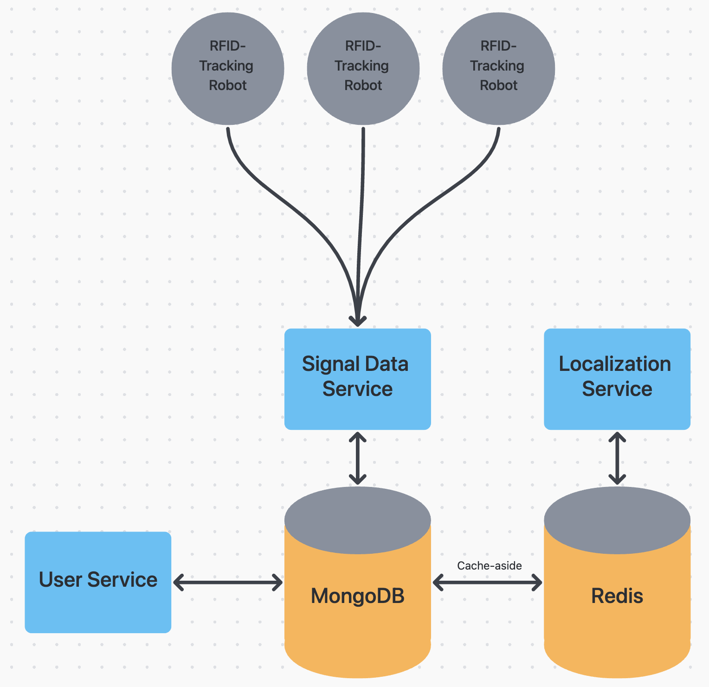

# Autonomous RFID Robot

**NOTE**: Unfortunately, the code for this project is proprietary and cannot be shared publically. If you want to learn more about this project, feel free to reach out to me.

This project involves the development of an autonomous robot, having RFID capabilities for tracking assets. The two major aspects of this project includes both signal processing and fabrication. The signal processing was handled with `Python`, where the robot was equipped with an RFID reader, receiving backscatter signals from different tags in the environment. These signals were then processed using two main localization algorithms, being received signal strength indicator (RSSI) and phase. The robot's job is then to traverse the environment and sample all RFID tags, which will use the localization algorithms to calculate where each are located.

To handle the processing of high-density RFID tags in an arbitrary environment, APIs and services were developed to provide real-time updates. The `Signal Data Service` is asynchronous in order to handle large traffic from multiple autonomous robots. The `Localization Service` was developed for handling the server-side localization post-processing, while the `User Service` was built for specifically handling user interaction with the data in real time. `MongoDB` and `Redis` are used in this case to handle the high locality and caching requirements of querying different assets.

Below is are high-level block diagrams detailing the backend and robotic component layouts.

